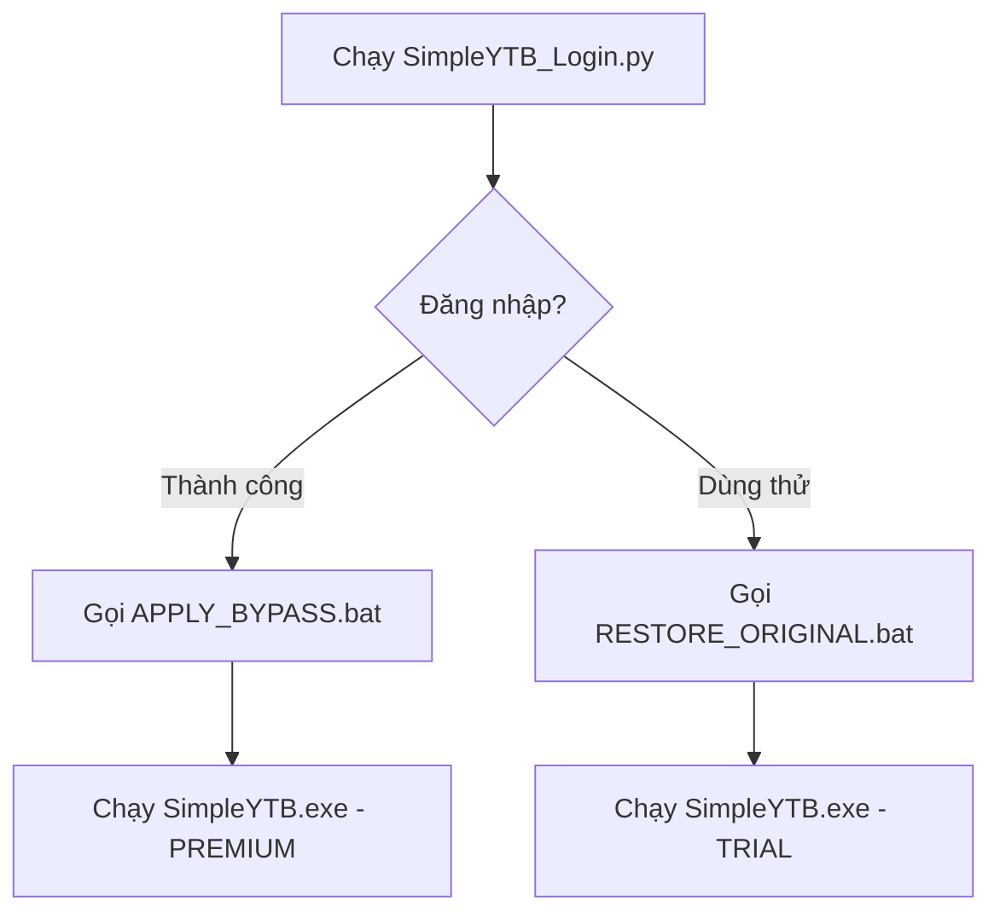

# SimpleYTB Login Launcher - Walkthrough

## Tổng quan

Đã tạo UI Login cho SimpleYTB với cơ chế:
- ✅ **Đăng nhập thành công** → Gọi `APPLY_BYPASS.bat` → Premium mode (không giới hạn)
- ❌ **Dùng thử** → Gọi `RESTORE_ORIGINAL.bat` → Trial mode (giới hạn 3 kết quả)

## Files đã tạo

| File | Mô tả |
|------|-------|
| [SimpleYTB_Login.py](file:///c:/Users/hp/AppData/Local/Programs/SimpleYTB/SimpleYTB_Login.py) | Login launcher với shooting stars animation |
| [APPLY_BYPASS.bat](file:///c:/Users/hp/AppData/Local/Programs/SimpleYTB/resources/APPLY_BYPASS.bat) | Apply bypass (option 1) |
| [RESTORE_ORIGINAL.bat](file:///c:/Users/hp/AppData/Local/Programs/SimpleYTB/resources/RESTORE_ORIGINAL.bat) | Restore original (option 2) |

## Cách hoạt động

## Supabase Database

Sử dụng chung database với Veo3:
- **URL**: `https://gkhkerlxxoihfvgnexaq.supabase.co`
- **Table**: `users`
- **Columns**: `username`, `password`

## Test Results

✅ Đăng nhập thành công → `APPLY_BYPASS.bat` chạy → Premium mode  
✅ Dùng thử → `RESTORE_ORIGINAL.bat` chạy → Trial mode  
✅ Shooting stars animation hoạt động
