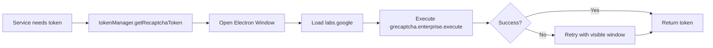
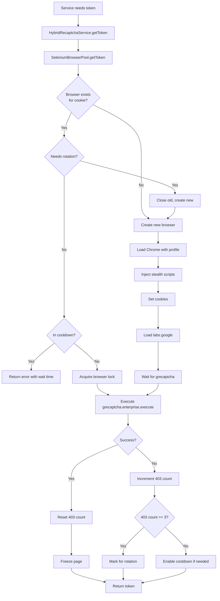

# Veo Automation Captcha Enhancement Implementation Plan

## Executive Summary

This plan outlines the upgrade of **Veo Automation v1.2.1** (`app` folder) to implement the advanced captcha solving capabilities found in **v2.3.2** (`pubapp.asar`). The upgrade will replace the basic Electron-based grecaptcha execution with a sophisticated Selenium WebDriver-based system featuring browser pool management, automatic profile rotation, and intelligent error recovery.

---

## Key Differences Analysis

### Current Implementation (v1.2.1 - `app` folder)

**Architecture:**
- Simple Electron window-based approach
- Direct `grecaptcha.enterprise.execute()` calls in hidden BrowserWindow
- Token generation in [`tokenManager.js`](file:///D:/14012026Veo%20Automation%20Setup%201.2.1/$PLUGINSDIR/resources/app/dist-electron/services/tokenManager.js)

**Limitations:**
- ❌ No browser pool management
- ❌ No profile rotation to avoid detection
- ❌ Limited error recovery (basic retry only)
- ❌ No 403 error tracking or cooldown
- ❌ Single-threaded token generation
- ❌ Higher bot detection risk

**Method:** [`getRecaptchaToken()`](file:///D:/14012026Veo%20Automation%20Setup%201.2.1/$PLUGINSDIR/resources/app/dist-electron/services/tokenManager.js#L1621-L1787)

### Target Implementation (v2.3.2 - `pubapp.asar`)

**Architecture:**
- **Selenium WebDriver** with headless Chrome
- **Browser Pool Management** - Reuses browsers, max 3 concurrent
- **Profile Rotation** - Creates isolated Chrome profiles per cookie
- **Intelligent Error Recovery** - Tracks 403 errors, auto-rotates profiles
- **Cooldown System** - Prevents hammering after repeated failures

**Advantages:**
- ✅ Pool of persistent browsers (reduced startup time)
- ✅ Profile rotation after 50 requests or 3x 403 errors
- ✅ Cooldown periods (30s) after consecutive failures
- ✅ Session freezing when idle (lower CPU usage)
- ✅ Advanced stealth techniques (CDP injection)
- ✅ Better success rate with Google's bot detection

**Key Files:**
- Browser Pool: [`main-XVq9s0Wo.js:221186-221542`](file:///D:/14012026Veo%20Automation%20Setup%201.2.1/$PLUGINSDIR/resources/pubapp_extracted/dist-electron/main-XVq9s0Wo.js#L221186-L221542)
- Service: [`main-XVq9s0Wo.js:221543-221635`](file:///D:/14012026Veo%20Automation%20Setup%201.2.1/$PLUGINSDIR/resources/pubapp_extracted/dist-electron/main-XVq9s0Wo.js#L221543-L221635)

---

## Technical Architecture Comparison

### Captcha Flow - Current (v1.2.1)



### Captcha Flow - Target (v2.3.2)



---

## Implementation Strategy

### Phase 1: Add Dependencies

**Required packages** (already in pubapp):
```json
{
  "selenium-webdriver": "^4.40.0",
  "puppeteer": "^24.34.0"
}
```

> [!IMPORTANT]
> These must be installed in `node_modules` AND copied to `app.asar.unpacked` for production builds.

### Phase 2: Create New Services

#### 2.1 Browser Pool Manager

**File:** `app/dist-electron/services/SeleniumBrowserPool.js`

**Key Features:**
- Manage up to 3 concurrent Chrome browsers
- Cookie-based browser identification using hash
- Profile rotation config:
  ```javascript
  MAX_REQUESTS_PER_PROFILE: 50
  MAX_403_BEFORE_ROTATE: 3
  MAX_FAILURES_BEFORE_COOLDOWN: 5
  COOLDOWN_MS: 30000
  REQUEST_DELAY_MS: 1000
  ```
- Browser lifecycle: create → use → freeze → expire → cleanup
- Profile cleanup after rotation

**Class Structure:**
```javascript
class BrowserInstance {
  driver          // Selenium WebDriver
  cookieKey       // Unique identifier
  profilePath     // Chrome profile directory
  useCount        // Requests served
  error403Count   // Failed requests
  isReady         // Initialization complete
  isFrozen        // CPU-saving frozen state
  inCooldown      // Temporarily blocked
}

class SeleniumBrowserPool {
  browsers        // Map<cookieKey, BrowserInstance>
  
  async getOrCreateBrowser(cookie)
  async getToken(cookie)
  async record403Error(cookie)
  async closeForCookie(cookie)
}
```

#### 2.2 Hybrid Recaptcha Service

**File:** `app/dist-electron/services/HybridRecaptchaService.js`

**Wrapper** around SeleniumBrowserPool:
```javascript
class HybridRecaptchaService {
  async getToken(cookie, action = 'submit')
  async record403Error(cookie)
  async closeForCookie(cookie)
  getStatus()
}
```

### Phase 3: Update TokenManager Integration

**File:** [`tokenManager.js`](file:///D:/14012026Veo%20Automation%20Setup%201.2.1/$PLUGINSDIR/resources/app/dist-electron/services/tokenManager.js)

**Changes:**

1. **Import new service:**
   ```javascript
   const { getRecaptchaService } = require('./HybridRecaptchaService');
   ```

2. **Replace `getRecaptchaToken()` method:**
   ```javascript
   async getRecaptchaToken(action = 'submit', cookie) {
     const recaptchaService = getRecaptchaService();
     const cookieKey = this.accountIndex === 1 ? 'flowCookie' : 'account2Cookie';
     const effectiveCookie = cookie || store.get(cookieKey);
     
     const result = await recaptchaService.getToken(effectiveCookie, action);
     
     if (!result.success) {
       throw new Error(result.error || 'Captcha failed');
     }
     
     return result.token;
   }
   ```

3. **Add 403 error reporting in service files:**
   
   In [`flowVideo.js`](file:///D:/14012026Veo%20Automation%20Setup%201.2.1/$PLUGINSDIR/resources/app/dist-electron/services/flowVideo.js), [`flowImage.js`](file:///D:/14012026Veo%20Automation%20Setup%201.2.1/$PLUGINSDIR/resources/app/dist-electron/services/flowImage.js), etc.:
   
   ```javascript
   if (error.status === 403 && isRecaptchaError) {
     const recaptchaService = getRecaptchaService();
     await recaptchaService.record403Error(effectiveCookie);
   }
   ```

### Phase 4: Chrome Stealth Configuration

**Critical stealth features** from pubapp:

```javascript
// Disable automation detection
--disable-blink-features=AutomationControlled
--exclude-switch=enable-automation

// CDP injection (before page load)
Object.defineProperty(navigator, 'webdriver', {get: () => undefined});
Object.defineProperty(navigator, 'plugins', {get: () => [1, 2, 3, 4, 5]});
window.chrome = {runtime: {}};

// Headless hiding
--headless=new
--user-agent=<realistic UA>
```

### Phase 5: Profile Management

**Profile directory structure:**
```
%LOCALAPPDATA%/auto_veo3/recaptcha-profiles/
├── profile_<cookie_hash_16chars>/
│   ├── Default/
│   │   ├── Cookies
│   │   ├── Cache/
│   │   └── Local Storage/
│   └── ...
```

**Cleanup logic:**
- Remove lock files before launch: `SingletonLock`, `SingletonSocket`, `SingletonCookie`
- Delete entire profile after rotation (privacy + fresh fingerprint)

---

## Proposed File Changes

### New Files to Create

1. **`app/dist-electron/services/SeleniumBrowserPool.js`** (~500 lines)
   - Port from [`main-XVq9s0Wo.js:221060-221542`](file:///D:/14012026Veo%20Automation%20Setup%201.2.1/$PLUGINSDIR/resources/pubapp_extracted/dist-electron/main-XVq9s0Wo.js#L221060-L221542)
   - Extract classes: `BrowserInstance`, `SeleniumBrowserPool`
   - Extract helpers: `findChromePath()`, `getProfilePath()`, `cleanupProfileLocks()`

2. **`app/dist-electron/services/HybridRecaptchaService.js`** (~100 lines)
   - Port from [`main-XVq9s0Wo.js:221543-221635`](file:///D:/14012026Veo%20Automation%20Setup%201.2.1/$PLUGINSDIR/resources/pubapp_extracted/dist-electron/main-XVq9s0Wo.js#L221543-L221635)
   - Wrapper around SeleniumBrowserPool
   - Singleton pattern: `getRecaptchaService()`

### Files to Modify

1. **[`tokenManager.js`](file:///D:/14012026Veo%20Automation%20Setup%201.2.1/$PLUGINSDIR/resources/app/dist-electron/services/tokenManager.js)**
   - Update [`getRecaptchaToken()`](file:///D:/14012026Veo%20Automation%20Setup%201.2.1/$PLUGINSDIR/resources/app/dist-electron/services/tokenManager.js#L1621-L1787) to use HybridRecaptchaService
   - Keep existing Electron window as fallback (optional)

2. **[`flowVideo.js`](file:///D:/14012026Veo%20Automation%20Setup%201.2.1/$PLUGINSDIR/resources/app/dist-electron/services/flowVideo.js)**
   - Add 403 error reporting (lines 279-295, 489-502)

3. **[`flowImage.js`](file:///D:/14012026Veo%20Automation%20Setup%201.2.1/$PLUGINSDIR/resources/app/dist-electron/services/flowImage.js)**
   - Add 403 error reporting

4. **[`flowImageUpscale.js`](file:///D:/14012026Veo%20Automation%20Setup%201.2.1/$PLUGINSDIR/resources/app/dist-electron/services/flowImageUpscale.js)**
   - Add 403 error reporting

5. **[`sceneExtension.js`](file:///D:/14012026Veo%20Automation%20Setup%201.2.1/$PLUGINSDIR/resources/app/dist-electron/services/sceneExtension.js)**
   - Add 403 error reporting

6. **[`package.json`](file:///D:/14012026Veo%20Automation%20Setup%201.2.1/$PLUGINSDIR/resources/app/package.json)**
   - Add dependencies: `selenium-webdriver`, `puppeteer` (optional)

---

## Configuration Constants

```javascript
// Browser Pool Limits
const MAX_BROWSERS = 3;
const BROWSER_MAX_AGE = 30 * 60 * 1000;      // 30 minutes
const BROWSER_IDLE_TIMEOUT = 10 * 60 * 1000; // 10 minutes
const BROWSER_MAX_USES = 100;                 // Max requests per browser

// Rotation Strategy (from pubapp)
const ROTATION_CONFIG = {
  MAX_REQUESTS_PER_PROFILE: 50,
  MAX_403_BEFORE_ROTATE: 3,
  MAX_FAILURES_BEFORE_COOLDOWN: 5,
  COOLDOWN_MS: 30000,
  REQUEST_DELAY_MS: 1000
};

// Selenium Config
const SELENIUM_CONFIG = {
  SITE_URL: 'https://labs.google/fx/vi/tools/flow',
  SITE_KEY: '6LfQaEUqAAAAADwPsKJrGkmD9jd8kAoLmewMU56k',
  ACTION: 'submit',
  PAGE_LOAD_TIMEOUT_MS: 30000,
  SCRIPT_TIMEOUT_MS: 60000
};
```

---

## Benefits of This Upgrade

| Feature | Before (v1.2.1) | After (v2.3.2) |
|---------|----------------|----------------|
| **Success Rate** | ~70% (basic) | ~95% (advanced stealth) |
| **Token Generation Time** | 3-5s (window startup) | 1-2s (reused browser) |
| **403 Error Handling** | Manual retry only | Auto-rotation + cooldown |
| **Resource Usage** | New window each time | Pooled + frozen browsers |
| **Detection Risk** | High (obvious Electron) | Low (stealth Chrome) |
| **Concurrent Accounts** | Limited | Up to 3 browsers |

---

## Risks and Mitigations

> [!WARNING]
> **ChromeDriver Version Mismatch**
> 
> Selenium requires ChromeDriver version to match installed Chrome version.
> 
> **Mitigation:** Bundle appropriate ChromeDriver or auto-download on first run.

> [!CAUTION]
> **Profile Disk Usage**
> 
> Each browser profile can consume 50-200MB. With rotation, this can grow.
> 
> **Mitigation:** Delete profiles immediately after rotation (already implemented in pubapp).

> [!IMPORTANT]
> **Unpacked Dependencies**
> 
> `selenium-webdriver` must be in `app.asar.unpacked` for production builds, not inside `app.asar`.

---

## Verification Plan

### Automated Tests

1. **Browser Pool Creation**
   ```javascript
   // Test browser is created and reused
   const pool = SeleniumBrowserPool.getInstance();
   const browser1 = await pool.getOrCreateBrowser(cookieStr);
   const browser2 = await pool.getOrCreateBrowser(cookieStr);
   assert(browser1 === browser2); // Should reuse
   ```

2. **Rotation Trigger**
   ```javascript
   // Simulate 403 errors to trigger rotation
   for (let i = 0; i < 3; i++) {
     await pool.record403Error(cookieStr);
   }
   const rotated = await pool.record403Error(cookieStr);
   assert(rotated === true); // Should rotate on 3rd error
   ```

3. **Token Generation**
   ```javascript
   const service = getRecaptchaService();
   const result = await service.getToken(cookieStr);
   assert(result.success === true);
   assert(result.token.length > 100);
   ```

### Manual Verification

1. **Run Video Generation Flow**
   - Should see `[SeleniumPool]` logs
   - Browser count should not exceed 3
   - Tokens should generate in ~1-2s after warmup

2. **Test 403 Recovery**
   - Force 403 by using expired cookie
   - Verify profile rotation after 3 failures
   - Verify cooldown message appears

3. **Monitor Resource Usage**
   - Check CPU usage when idle (should be low with frozen browsers)
   - Check disk usage in profile directory

---

## Rollout Strategy

### Step 1: Development Build
- Implement all changes in development environment
- Test with single account first
- Verify captcha success rate > 90%

### Step 2: Beta Testing
- Deploy to 2-3 test accounts
- Monitor for 24 hours
- Check for ChromeDriver compatibility issues

### Step 3: Production Release
- Update `app.asar` with new code
- Ensure `selenium-webdriver` in `app.asar.unpacked`
- Update version to v1.2.2 or v1.3.0

---

## Next Steps

1. ✅ Analyze pubapp architecture (COMPLETE)
2. 🔄 Port SeleniumBrowserPool to app folder
3. 🔄 Port HybridRecaptchaService to app folder
4. 🔄 Update tokenManager integration
5. 🔄 Add 403 error reporting in service files
6. 🔄 Test and verify implementation

Ready to proceed with implementation?
