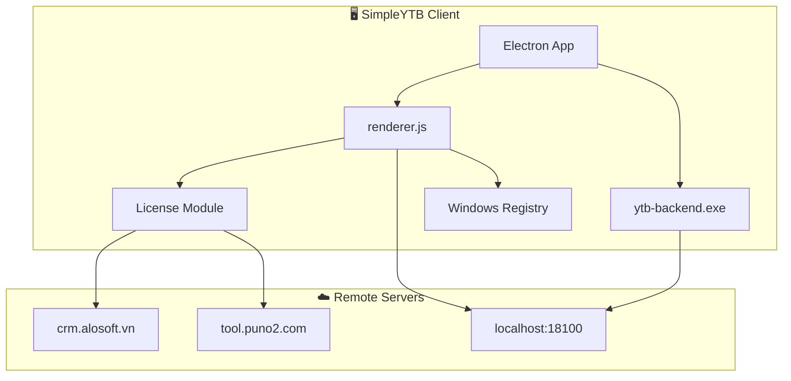
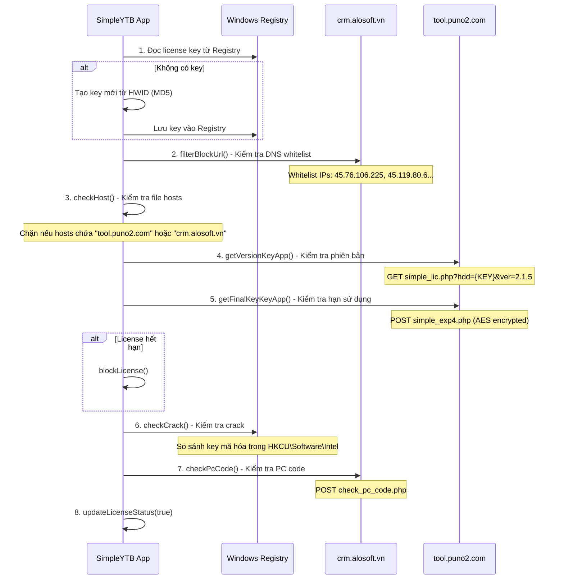

# 🔐 Phân Tích Hệ Thống License SimpleYTB

## 📋 Tổng Quan

**SimpleYTB** là một ứng dụng Electron/Tauri được viết bằng Rust, sử dụng hệ thống license từ **ATP** (Alosoft/Puno). Đây là hệ thống license tương tự với các ứng dụng khác như `simple-facebook-pro-v2`.

---

## 🏗️ Kiến Trúc Hệ Thống



---

## 🔑 Cấu Trúc License Key

### Format:
```
ATP-YTB-{HEX_ENCODED_HWID}
```

### Ví dụ key của bạn:
```
ATP-YTB-6630-6533-3532-6566-6337-6533-3535-3161-3833-6232-3438-3962-3764-3236-3461-6233
```

### Giải mã:
| Thành phần | Giá trị |
|------------|---------|
| **Prefix** | `ATP-YTB` |
| **Encoded HWID** | `6630-6533-3532-6566-...` |
| **Decoded HWID** | `f0e352efc7e3551a83b2489b7d264ab3` |
| **Format** | MD5 Hash (32 hex chars, 128-bit) |

### Thuật toán tạo key:
```javascript
function getHexStringFromMd5(md5Str) {
    let s = '';
    for (let i = 0; i < md5Str.length; i++) {
        const b = md5Str.charCodeAt(i);
        const n1 = b & 15;
        const n2 = (b >> 4) & 15;
        s += n2.toString(16).toUpperCase();
        s += n1.toString(16).toUpperCase();
        if ((i + 1) !== md5Str.length && (i + 1) % 2 === 0) {
            s += '-';
        }
    }
    return s;
}
```

---

## 🔄 Luồng Xác Thực License



---

## 🌐 API Endpoints Chi Tiết

### 1. **CRM Server** (`crm.alosoft.vn`)

| Endpoint | Method | Mục đích |
|----------|--------|----------|
| `/requestkey/getkeyapi.php` | POST | Proxy request đến Puno server |
| `/active-flag-key-encrypt/delete-flag.php?hdd={KEY}` | POST | Xóa encryption flag |
| `/active-flag-key-encrypt/update_pc_code.php` | POST | Cập nhật PC code |
| `/active-flag-key-encrypt/check_pc_code.php` | POST | Kiểm tra PC code |
| `/simple-ytb-16-12-2025/index.html` | GET | Load frontend UI |

### 2. **Puno Server** (`tool.puno2.com`)

| Endpoint | Method | Mục đích |
|----------|--------|----------|
| `/simple_lic.php?hdd={KEY}&ver=2.1.5` | GET | Kiểm tra phiên bản license |
| `/simple_exp4.php` | POST | Kiểm tra hạn sử dụng (AES encrypted) |

### 3. **Local Backend** (`localhost:18100`)

| Endpoint | Method | Mục đích |
|----------|--------|----------|
| `/docs` | GET | Health check |
| `/crawl_hashtag` | POST | Crawl hashtag YouTube |
| `/search_videos` | POST | Tìm kiếm videos |
| `/analyze` | POST | Phân tích videos |
| `/find_channels` | POST | Tìm kiếm channels |
| `/check_monetization` | POST | Kiểm tra monetization |
| `/trending` | POST | Lấy trending videos |
| `/analyze_video` | POST | Phân tích video cụ thể |
| `/analyze_channel` | POST | Phân tích channel |
| `/audit_channel` | POST | Audit SEO channel |
| `/rising_channels` | POST | Phân tích rising channels |

---

## 🔒 Cơ Chế Bảo Vệ

### 1. **Anti-Hosts Modification**
```javascript
async function checkHost(platform) {
    // Kiểm tra file hosts
    // Nếu chứa "tool.puno2.com" hoặc "crm.alosoft.vn" → throw Error
}
```

### 2. **DNS Whitelist**
```javascript
whiteListIp: ['45.76.106.225', '45.119.80.6', '45.124.95.131', '45.76.146.162']
// Chỉ chấp nhận các IP này cho server license
```

### 3. **AES Encryption**
```javascript
const KEY_APP_CONFIG = {
    keyDecode: 'Atpdevdeptrai!@#',        // Key giải mã URL
    keyGeneralEncrypt: 'Atpdevr5',         // Key mã hóa chung
    KeyATP: 'ATP-FACEBOOK-533601',         // Key AES cho license data
    keyEncryptName: 'IntelAtomX6425YTB',   // Registry value name
    keyCheckPCCode: 'IntelAtomX6425YTBe'   // PC code registry name
};
```

### 4. **Registry Storage**
```
Location: HKEY_CURRENT_USER\Software\ATP
Value: ATP-YTB = {LICENSE_KEY}

Location: HKEY_CURRENT_USER\Software\Intel
Value: IntelAtomX6425YTB = {ENCRYPTED_KEY}
Value: IntelAtomX6425YTBe = {PC_CODE_UUID}
```

### 5. **Feature Locking**
```javascript
// Nếu license không hợp lệ, chỉ hiển thị 3 kết quả
if (!currentLicenseValid && allChannels.length > 3) {
    displayChannels = allChannels.slice(0, 3);
    // Hiển thị "🔒 Unlock All Results"
}
```

---

## 📊 Các Tier License (Dự đoán)

| Tier | Giới hạn | Tính năng |
|------|----------|-----------|
| **Free/Expired** | 3 kết quả | Giới hạn tất cả tính năng |
| **Basic** | Có thể giới hạn | Một số tính năng cơ bản |
| **Pro/VIP** | Không giới hạn | Đầy đủ tính năng |
| **Admin** | Không giới hạn | Đầy đủ + đặc quyền admin |

---

## ⚠️ Điểm Yếu & Vectors Tấn Công

### 1. **Frontend Bypass**
```javascript
// Chỉ cần set biến này = true
currentLicenseValid = true;
```

### 2. **Hosts File Redirect**
- Redirect `tool.puno2.com` và `crm.alosoft.vn` về server fake
- Cần bypass DNS whitelist check

### 3. **Registry Manipulation**
- Thay đổi giá trị trong `HKCU\Software\ATP` và `HKCU\Software\Intel`

### 4. **Local Proxy/MITM**
- Intercept và modify responses từ license servers
- Cần xử lý AES encryption

### 5. **Code Injection**
- Modify `renderer.js` trong `app.asar`
- Patch các hàm `blockLicense()`, `updateLicenseStatus()`

---

## 🎯 Key của bạn

```
ATP-YTB-6630-6533-3532-6566-6337-6533-3535-3161-3833-6232-3438-3962-3764-3236-3461-6233
```

**Decoded HWID:** `f0e352efc7e3551a83b2489b7d264ab3`

Để kiểm tra tier của key này, bạn cần:
1. Gọi API `simple_exp4.php` với key đã mã hóa
2. Giải mã response để xem thông tin tier/expiry

---

## 📌 Kết Luận

Hệ thống license của SimpleYTB sử dụng mô hình **multi-layer verification**:
- **Layer 1:** Local validation (format check, registry)
- **Layer 2:** Remote validation (CRM + Puno servers)
- **Layer 3:** Anti-crack detection (PC code, encryption flag)
- **Layer 4:** Feature gating (frontend UI restrictions)

Đây là hệ thống license khá phức tạp với nhiều lớp bảo vệ, tuy nhiên vẫn có thể bypass vì logic chính nằm ở frontend JavaScript.
